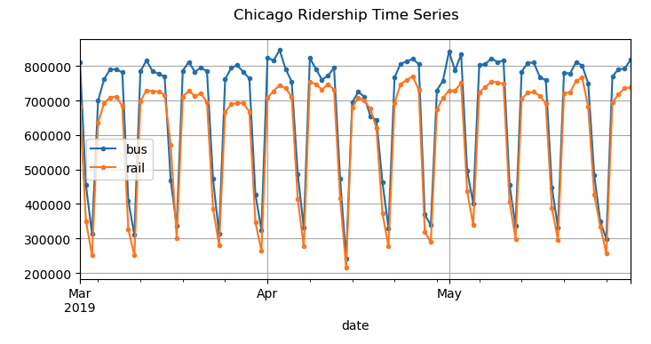
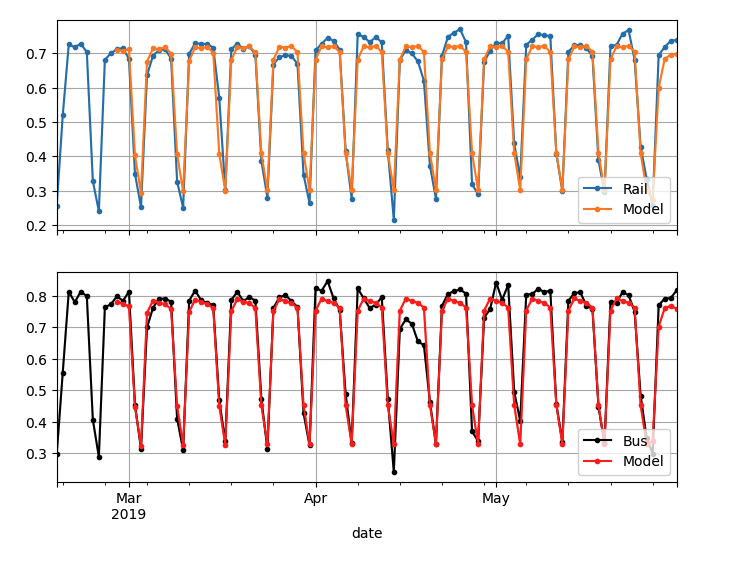

# Time series forecasting: Chicago ridership

This repo contains a detailed analysis of the Chicago public transportation (bus and rail) time series from 2001 to just before the pandemic. For the exploratory analysis, it includes naive forecasting, autocorrelation and partial autocorrelation analysis. Models explored include: 

- (S)AR(I)MA with `statsmodels`
- Linear
- RNN with PyTorch
- LSTM
- GRU
- CNN

For the deep learning models, you need a NVIDIA GPU. They work well using Google Collab (I developed these notebooks on Collab). `my_functions.py` contains several helper functions for training and inference with pytorch, to hide boilerplate code from the notebooks.

## Notebooks

[Notebook 1](1-basics,%20ARIMA.ipynb): EDA, naive, ACF, PACF, (S)AR(I)MA.

[Notebook 2](2-ML,%20linear%20model.ipynb): prepare data for pytorch, linear model.

[Notebook 3](3_RNN_and_more—need_NVIDIA_GPU.ipynb): RNN, deep RNN, multivariate/multitarget, seq2vec, uncertainty band.

[Notebook 4](4_LSTM—need_NVIDIA_GPU.ipynb): LSTM, GRU, CNN, wavenet.

[Notebook 5](5-XGBoost.ipynb): XGBoost.

## TODO

- [x] model with XGBoost
- [x] include plots and basic description in README
